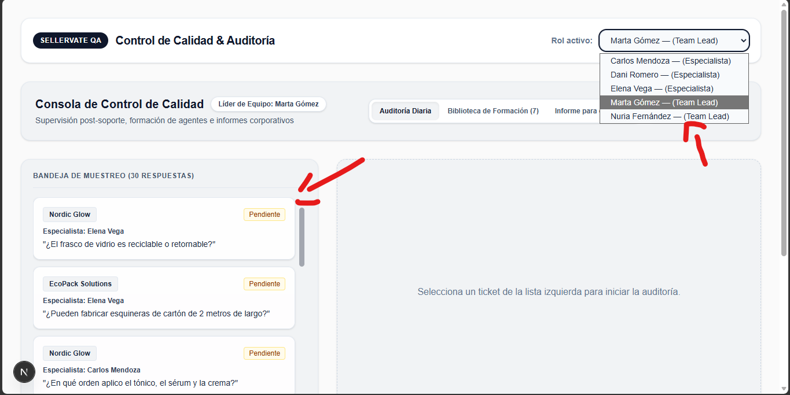
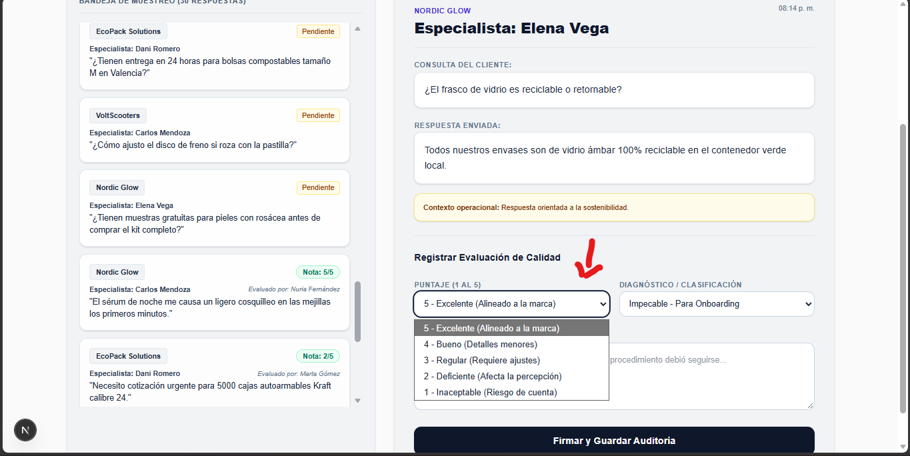
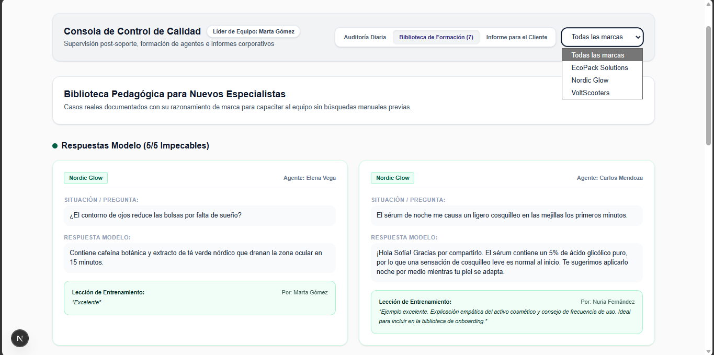
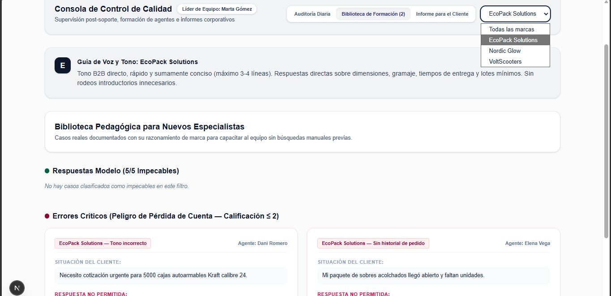
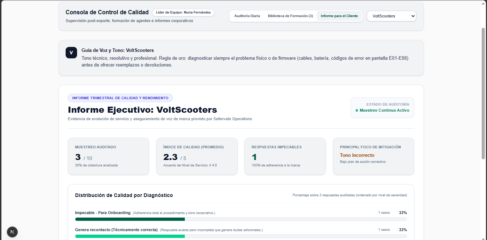

# Sellervate CX Hub — Control de Calidad, Onboarding & Demostración

> **Tiempo efectivo de desarrollo:** ~4 horas y 45 minutos (dentro del límite estricto de 6 horas).

Plataforma interna para la gestión, auditoría y aseguramiento de calidad en soporte al cliente para marcas de comercio electrónico (*VoltScooters*, *EcoPack*, *Nordic Glow*).

---

## 📸 Capturas de Pantalla

### 1. Consola de Muestreo Diario y Auditoría (Team Lead)


> **Flujo Operativo Documentado en la Captura:**
> * **Identidad del Auditor:** La consola reconoce activamente al líder en turno (ej. *Marta Gómez* o *Nuria Fernández*), permitiéndole supervisar todas las marcas asignadas sin restricciones de lectura.
> * **Bandeja de Muestreo:** En el lateral izquierdo se organizan las respuestas enviadas por los especialistas, diferenciando de un vistazo los casos pendientes de evaluación de aquellos ya auditados con su respectiva calificación.
> * **Panel de Evaluación Activa:** Al seleccionar un ticket, el auditor revisa la consulta del cliente, la respuesta enviada y el contexto operativo para asignar la calificación (1 a 5), la bandera de diagnóstico y el feedback pedagógico firmado.

### 2. Flujo de Evaluación de Calidad (Scoring Cuantitativo y Diagnóstico Operativo)


> **Desacoplamiento de Métrica y Causa Raíz:**
> * **Puntaje Numérico (1 al 5):** Cuantifica la adherencia al estándar de servicio para alimentar las métricas globales del equipo y el cumplimiento de SLAs corporativos.
> * **Diagnóstico Operacional:** Clasifica el motivo exacto de la calificación (ej. *Impecable*, *Tono incorrecto*, *Sin historial de pedido*), permitiendo enviar los casos de estudio directamente a la Biblioteca de Formación y mapear las áreas de riesgo por marca.
> * **Retroalimentación Firmada:** Registro cualitativo obligatorio que queda vinculado permanentemente al identificador del líder auditor para garantizar transparencia y calibración de criterios.

### 3. Biblioteca Pedagógica y Filtrado por Marca (Training & Onboarding Problem)

| Vista Global: Todas las Marcas | Vista Aislada: Marca Específica y Guía de Tono |
| :---: | :---: |
|  |  |

> **Resolución del Problema de Onboarding:**
> * **Vista Global (Todas las marcas):** Agrupa automáticamente los casos auditados del sistema en dos secciones clave: *Respuestas Modelo (5/5)* y *Errores Críticos (≤ 2)*, permitiendo a los líderes capacitar a nuevos especialistas con lecciones reales sin tener que buscar tickets manualmente la noche anterior.
> * **Aislamiento y Contexto por Marca:** Al filtrar por una cuenta (ej. *EcoPack Solutions*), la biblioteca reduce los casos al contexto específico de ese cliente y despliega la **Guía de Voz y Tono Oficial**, asegurando que los agentes comprendan por qué una respuesta breve o técnica aplica a un cliente y desentona en otro.

### 4. Informe Ejecutivo para el Cliente (Resolución del "Proof Problem")


> **Evidencia Cuantitativa y Mitigación Operativa:**
> * **Guía de Voz y Tono de la Marca:** Muestra las directrices operativas específicas en la cabecera (ej. la regla de oro de VoltScooters de diagnosticar cables, batería o códigos E01-E08 antes de tramitar garantías).
> * **Métricas Ejecutivas Clave:** Consolida el volumen del muestreo analizado, el promedio de calidad frente al SLA contractual (≥ 4.5), el recuento de respuestas impecables y el principal foco de mitigación detectado en el período.
> * **Distribución de Calidad por Diagnóstico:** Barras porcentuales ordenadas jerárquicamente por nivel de severidad, permitiendo demostrar con datos auditados las mejoras operativas trimestrales ante comités directivos.

Sigue estos pasos para clonar y levantar el proyecto en tu entorno local:

### 1. Clonar el repositorio
```bash
git clone https://github.com/PapiPain/sellervate.git
cd sellervate